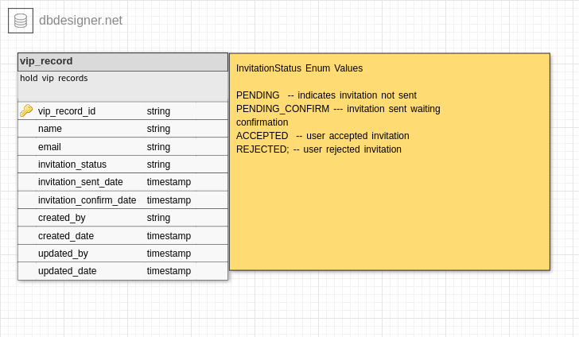

## Ondeck VIP management

This is solution for assesement [here](https://odteam.notion.site/odteam/No-Code-Infrastructure-Engineer-Take-Home-Test-0987b15357f941ab80ca79c16b23c9cd)

## Tools Used 
- Java 11 
- Spring Boot 2.6.3
- Gradle build tool 
- H2 in memory DB
- java SMTP email client 
- thymeleaf for templating engine 
- docker
- git , github 

## How to run this app on your local environment 

- Pull the latest docker image from Dockerhub [here](https://hub.docker.com/r/hsolomondocker/ondeck_vip/tags)

     Or simply run this command to pull the latest image tag

    `docker pull hsolomondocker/ondeck_vip`

    Run this command to confirm if the image is loaded to your host machine 

    ` docker image ls `

    you should see vip docker image listed `hsolomondocker/ondeck_vip:latest `
  
- Run this command to launch the conainter with ondeck vip app 
   
   ` docker run -it -p9090:8080 hsolomondocker/ondeck_vip:latest `
   
    **Make sure that port 9090 is open in your machine and also not blocked by any firewall setup you may have**
   
- You can Run `docker ps ` to verify that the container is running on your local docker engine
- Open your browser and go to (http://localhost:9090/api-docs.html) you should see swagger api doc page

## How to test the functionalities 

1)  POST  **/vip/create**  - is a simple restful endpoint to create a VIP record and send invitation to the given email 

      open your terminal and execute this curl command 

     **you should change the email value in the post data to a valid email that you have access to , this will be good to demonistrate the whole functionality**

      `curl --header "Content-Type: application/json" --request POST --data '{"name":"Henok","email":"solomonmail88@gmail.com"}' http://localhost:9090/vip/create | json_pp`

     If the request is successful you should see a response json with the newly created vip record
      
      sample response 

      `      {
         "createdBy" : "system",
         "createdDate" : "2022-02-21T20:40:28.930234",
         "email" : "solomonmail88@gmail.com",
         "invitationConfirmDate" : null,
         "invitationConfirmRemark" : null,
         "invitationSentDate" : null,
         "invitationStatus" : "PENDING",
         "name" : "Henok",
         "updatedBy" : "system",
         "updatedDate" : "2022-02-21T20:40:28.930239",
         "vipRecordId" : "3bfc5c85-97b5-40bf-bc2f-fdc5041edc41"
      }`

      
      
     

      *Also this endpoint will try to **send an actual invitation email** to the destination vip email address*
        hence please go a head and check the inbox

       Alternatively you can call `GET /vip/findAll` to verify that vip record is created

      > The app is built with generic error handler , that means if your call to any of vip api's ended with error then you should expect json reponse that looks like below - with different error message ...

        `      {
           "error" : "bad request , please fix your request and try again",
           "message" : "vip record doesn't exist ",
           "path" : "/vip/accept/250cb745-82e8-431b-8532-a6e0af9f53d4",
           "status" : 400,
           "timestamp" : "2022-02-21"
        }
`

2)  GET  **vip/findAll** - is a simple restful endpoint to list all registred vip records in the current H2 in memory DB

      open your terminal and execute this curl command 

      `curl --header "Content-Type: application/json" --request GET http://localhost:9090/vip/findAll | json_pp`

      you should see list of VIP records currently registred in your local H2 in memory DB 

      sample response 

      `
            [
         {
            "createdBy" : "system",
            "createdDate" : "2022-02-21T20:40:28.930234",
            "email" : "solomonmail88@gmail.com",
            "invitationConfirmDate" : null,
            "invitationConfirmRemark" : null,
            "invitationSentDate" : "2022-02-21T20:40:35.044186",
            "invitationStatus" : "PENDING_CONFIRM",
            "name" : "Henok",
            "updatedBy" : "system",
            "updatedDate" : "2022-02-21T20:40:28.930239",
            "vipRecordId" : "3bfc5c85-97b5-40bf-bc2f-fdc5041edc41"
         }
      ]
      `

    *we are using H2 in mememory DB that means the DB uses its runtime memory to store the records , this means any records that you created will be lost if you restart your docker conatiner ** Its done this way because the app is intended only for demonstration purpose*

  
3)  GET  **vip/Accept/{vipRecordId}** & **vip/reject/{vipRecordId}** - mark the invitation status of vip record to **ACCEPTTED OR REJECTED**  

      > The invitation email that is sent during the create operation should have two embedded buttons 

      > `Accept Invitation` & `No Thanks `
      
      > You can click either of this buttons to test accept and reject endpoints 
      
      you can also do it using curl command 
      
      > But First call the `/vip/findAll` and copy the vipRecordId value which you want to update 

      then 

      `curl --header "Content-Type: application/json" --request GET http://localhost:9090/vip/accept/250cb745-82e8-431b-8532-a6e0af9f53d4 | json_pp`

       sample response 

        `    {
                 "createdBy" : "system",
                 "createdDate" : "2022-02-21T20:40:28.930234",
                 "email" : "solomonmail88@gmail.com",
                 "invitationConfirmDate" : "2022-02-21T21:17:36.92906",
                 "invitationConfirmRemark" : null,
                 "invitationSentDate" : "2022-02-21T20:40:35.044186",
                 "invitationStatus" : "ACCEPTED",
                 "name" : "Henok",
                 "updatedBy" : "system",
                 "updatedDate" : "2022-02-21T20:40:28.930239",
                 "vipRecordId" : "3bfc5c85-97b5-40bf-bc2f-fdc5041edc41"
              }`
